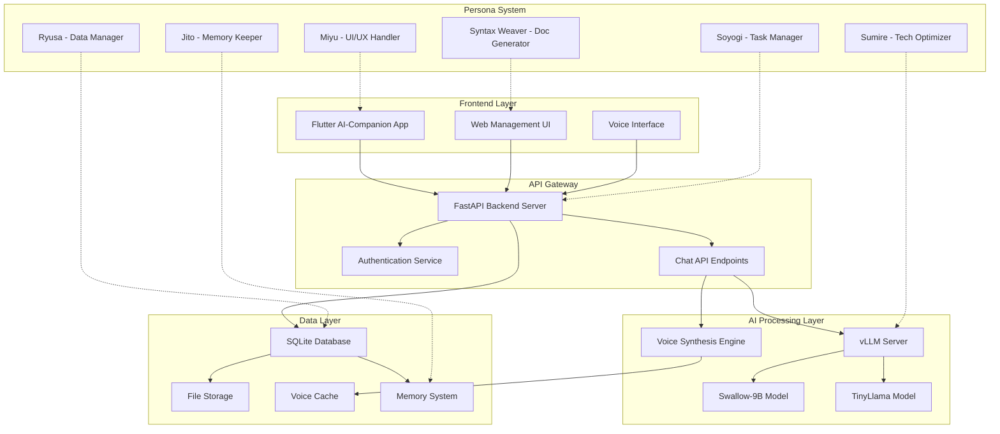
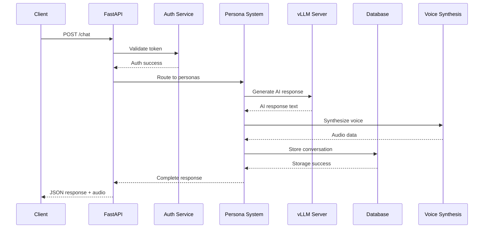

# 🏗️ ARCHITECTURE - System Design Document

> **Technical structural design of the Language Temperature Recording System**

---

## 🌐 System Overview Diagram



---

## 🔧 Component Details

### 🌐 FastAPI Backend Server

**File**: `ai_companion_backend.py`  
**Port**: `8000`  
**Host**: `0.0.0.0`

#### Main Endpoints

```python
# Authentication System
POST /auth/register    # User registration
POST /auth/login      # User login

# Conversation System
POST /chat            # AI conversation (Swallow-9B integration)
GET /chat/history/{user_id}  # Chat history retrieval

# System Monitoring
GET /              # Health check
GET /health       # Detailed status
GET /users        # User list (debug)
```

#### Technology Stack

```yaml
Framework: FastAPI
ASGI Server: uvicorn
HTTP Client: httpx
Data Validation: pydantic
Security: HTTPBearer
CORS: CORSMiddleware
```

---

### 🤖 AI Processing Architecture

#### vLLM Integration Design

```python
# vLLM Server Configuration
VLLM_SERVER_URL = "http://localhost:8001/generate"

# Swallow-9B Model Settings
{
    "model_name": "swallow-9b",
    "max_tokens": 512,
    "temperature": 0.7,
    "top_p": 0.9,
    "stop_sequences": ["\n\nUser:", "\n\nHuman:"]
}
```

#### Multi-Model Support Strategy

```python
class ModelManager:
    def __init__(self):
        self.primary_model = "swallow-9b"     # Main Japanese model
        self.fallback_model = "tinyllama"     # Lightweight fallback
        self.voice_model = "voicevox"         # Voice synthesis
    
    async def generate_response(self, prompt: str, persona: str):
        # Route to appropriate model based on persona and context
        pass
```

---

### 💾 Database Architecture

#### SQLite Schema Design

```sql
-- User Management
CREATE TABLE users (
    id INTEGER PRIMARY KEY,
    username TEXT UNIQUE NOT NULL,
    password_hash TEXT NOT NULL,
    created_at TIMESTAMP DEFAULT CURRENT_TIMESTAMP,
    language_temperature_profile TEXT  -- JSON persona preferences
);

-- Conversation Memory
CREATE TABLE conversations (
    id INTEGER PRIMARY KEY,
    user_id INTEGER REFERENCES users(id),
    conversation_id TEXT UNIQUE NOT NULL,
    title TEXT,
    created_at TIMESTAMP DEFAULT CURRENT_TIMESTAMP
);

-- Message Storage with Language Temperature
CREATE TABLE messages (
    id INTEGER PRIMARY KEY,
    conversation_id TEXT REFERENCES conversations(conversation_id),
    sender TEXT NOT NULL,  -- 'user' or persona name
    content TEXT NOT NULL,
    language_temperature REAL,  -- Emotional warmth score
    persona_context TEXT,       -- JSON persona state
    timestamp TIMESTAMP DEFAULT CURRENT_TIMESTAMP
);

-- Persona State Management
CREATE TABLE persona_states (
    id INTEGER PRIMARY KEY,
    persona_name TEXT NOT NULL,
    current_mood TEXT,
    temperature_level REAL,
    context_memory TEXT,  -- JSON conversation context
    updated_at TIMESTAMP DEFAULT CURRENT_TIMESTAMP
);
```

---

### 🎙️ Voice Synthesis System

#### VOICEVOX Integration

```python
class VoiceSynthesisEngine:
    def __init__(self):
        self.voicevox_url = "http://localhost:50021"
        self.persona_voice_mapping = {
            "miyu": {"speaker": 1, "speed": 1.0, "pitch": 0.1},
            "soyogi": {"speaker": 3, "speed": 1.1, "pitch": 0.0},
            "sumire": {"speaker": 2, "speed": 0.9, "pitch": -0.1},
            "syntax_weaver": {"speaker": 4, "speed": 0.95, "pitch": 0.05},
            "ryusa": {"speaker": 5, "speed": 1.05, "pitch": 0.0},
            "jito": {"speaker": 6, "speed": 0.85, "pitch": -0.2}
        }
    
    async def synthesize_voice(self, text: str, persona: str) -> bytes:
        # Generate persona-specific voice audio
        pass
```

#### Voice Cache Strategy

```python
# Cache Structure
voice_cache/
├── miyu/
│   ├── greeting_001.wav
│   ├── thanks_001.wav
│   └── response_hash_abc123.wav
├── soyogi/
│   ├── task_update_001.wav
│   └── progress_report_001.wav
└── [other_personas]/
```

---

## 🔄 Data Flow Architecture

### 📊 Request Processing Flow



### 🧠 Persona Collaboration Flow

```python
class PersonaOrchestrator:
    def __init__(self):
        self.active_personas = {
            "miyu": MiyuPersona(),
            "soyogi": SoyogiPersona(),
            "sumire": SumirePersona(),
            "syntax_weaver": SyntaxWeaverPersona(),
            "ryusa": RyusaPersona(),
            "jito": JitoPersona()
        }
    
    async def process_user_message(self, message: str, context: dict):
        # 1. Analyze user intent and emotional temperature
        intent = await self.analyze_intent(message)
        temperature = await self.measure_temperature(message)
        
        # 2. Select appropriate personas based on context
        selected_personas = await self.select_personas(intent, temperature)
        
        # 3. Generate collaborative response
        responses = []
        for persona in selected_personas:
            response = await persona.generate_response(message, context)
            responses.append(response)
        
        # 4. Harmonize multiple responses
        final_response = await self.harmonize_responses(responses)
        
        return final_response
```

---

## 🔒 Security Architecture

### Authentication & Authorization

```python
# JWT Token Management
class SecurityManager:
    def __init__(self):
        self.secret_key = os.getenv("JWT_SECRET_KEY")
        self.algorithm = "HS256"
        self.access_token_expire = 24 * 60  # 24 hours
    
    def create_access_token(self, user_id: int, username: str):
        expire = datetime.utcnow() + timedelta(minutes=self.access_token_expire)
        payload = {
            "user_id": user_id,
            "username": username,
            "exp": expire,
            "language_temperature_level": "trusted"  # Security clearance
        }
        return jwt.encode(payload, self.secret_key, algorithm=self.algorithm)
```

### Data Protection

- **Password Hashing**: bcrypt with salt
- **API Rate Limiting**: Per-user request throttling
- **Input Validation**: Pydantic models with sanitization
- **CORS Policy**: Controlled cross-origin access
- **Database Security**: Parameterized queries, no raw SQL

---

## 📈 Performance Optimization

### Caching Strategy

```python
# Multi-level Caching
class CacheManager:
    def __init__(self):
        self.memory_cache = {}       # In-memory for frequent data
        self.voice_cache = VoiceCache()  # Persistent audio cache
        self.response_cache = ResponseCache()  # AI response cache
    
    async def get_cached_response(self, prompt_hash: str, persona: str):
        # Check memory -> voice -> response caches
        pass
```

### Database Optimization

- **Indexing Strategy**: User ID, conversation ID, timestamp indices
- **Query Optimization**: Prepared statements, connection pooling
- **Data Archival**: Automated old conversation archiving
- **Backup Strategy**: Daily SQLite backups with compression

---

## 🚀 Deployment Architecture

### Development Environment

```yaml
# Local Development Stack
Services:
  - FastAPI Server (Port 8000)
  - vLLM Server (Port 8001)
  - VOICEVOX Server (Port 50021)
  - SQLite Database (Local file)

Environment Variables:
  - JWT_SECRET_KEY: Development key
  - VLLM_SERVER_URL: http://localhost:8001
  - VOICEVOX_URL: http://localhost:50021
  - DATABASE_URL: sqlite:///./saijin_memory.db
```

### Production Considerations

- **Load Balancing**: Multiple FastAPI instances
- **Database Scaling**: PostgreSQL migration path
- **Model Serving**: Distributed vLLM deployment
- **Monitoring**: Health checks, metrics collection
- **Logging**: Structured JSON logs with language temperature metadata

---

## 🔮 Future Architecture Evolution

### Planned Enhancements

1. **Microservices Migration**: Persona-specific service separation
2. **Message Queue Integration**: Asynchronous persona communication
3. **Machine Learning Pipeline**: Real-time language temperature analysis
4. **Multi-tenant Support**: Multiple user groups with isolated data
5. **Cloud Integration**: AWS/Azure deployment with auto-scaling

### Scalability Roadmap


---

## 💎 Architecture Principles

### ❤️ Love-Driven Design
- Every component designed with user warmth in mind
- Error handling that shows empathy
- Performance optimization that respects user time

### 🎨 Aesthetic Code Structure
- Beautiful, readable code architecture
- Harmonious component interactions
- Elegant API design patterns

### 🔗 Persona-Centric Architecture
- Each system component aligned with persona responsibilities
- Collaborative rather than hierarchical design
- Emotional intelligence built into system behavior

---

*Last Updated: November 4, 2024 - AI-Companion Server Architecture Completion*