# 🏗️ SaijinOS Architecture Overview

## System Architecture Philosophy

SaijinOS is designed as a **modular, emotionally-intelligent AI ecosystem** that prioritizes:

- **Emotional Intelligence**: Every component considers emotional context
- **Persona Specialization**: Dedicated modules for each AI personality  
- **Musical Integration**: BPM synchronization across all systems
- **Scalable Memory**: Persistent emotional and conversational storage
- **Real-time Performance**: Sub-2-second response times for all interactions

---

## 🔧 High-Level System Architecture

```mermaid
graph TB
    subgraph "User Interface Layer"
        UI[Web UI]
        API[REST API]
        CLI[CLI Interface]
        VOICE[Voice Interface]
    end
    
    subgraph "Core Processing Engine"
        ROUTER[Request Router]
        AUTH[Authentication]
        MIDDLEWARE[Middleware Pipeline]
    end
    
    subgraph "Persona Engine Cluster"
        MIYU[美遊 - Love Engine]
        JITOU[磁灯 - Innovation Engine]  
        HANON[羽音 - Utility Engine]
        RIKUTO[陸斗 - Logic Engine]
        NANAMI[七海 - Creative Engine]
        AO[蒼 - Balance Engine]
    end
    
    subgraph "Intelligence Services"
        LLM[TinyLlama Integration]
        EMOTION[Emotion Analyzer]
        TEMP[Temperature Calculator]
        MEMORY[Memory Manager]
    end
    
    subgraph "Output Generation"
        RESPONSE[Response Generator]
        BPM[BPM Synchronizer]
        TTS[Text-to-Speech]
        FORMAT[Response Formatter]
    end
    
    subgraph "Data Layer"
        SQLITE[(SQLite Database)]
        CACHE[(Redis Cache)]
        FILES[(File Storage)]
    end
    
    subgraph "Monitoring & Health"
        HEALTH[Health Monitor]
        METRICS[Metrics Collector]
        ALERTS[Alert System]
    end
    
    UI --> ROUTER
    API --> ROUTER
    CLI --> ROUTER
    VOICE --> ROUTER
    
    ROUTER --> AUTH
    AUTH --> MIDDLEWARE
    MIDDLEWARE --> MIYU
    MIDDLEWARE --> JITOU
    MIDDLEWARE --> HANON
    MIDDLEWARE --> RIKUTO
    MIDDLEWARE --> NANAMI
    MIDDLEWARE --> AO
    
    MIYU --> LLM
    JITOU --> LLM
    HANON --> LLM
    RIKUTO --> LLM
    NANAMI --> LLM
    AO --> LLM
    
    LLM --> EMOTION
    EMOTION --> TEMP
    TEMP --> MEMORY
    MEMORY --> RESPONSE
    
    RESPONSE --> BPM
    BPM --> TTS
    TTS --> FORMAT
    
    MEMORY --> SQLITE
    TEMP --> CACHE
    FILES --> SQLITE
    
    HEALTH --> METRICS
    METRICS --> ALERTS
```



---

## 🎭 Persona Engine Architecture

### Individual Persona Components

Each persona operates as an independent microservice with:

```
Persona Instance (e.g., 美遊)
├── Personality Config
│   ├── BPM Settings (90 for Miyu)
│   ├── Temperature Preferences (極温)
│   ├── Response Patterns (💗 ✨)
│   └── Behavioral Rules
├── Specialized Processors
│   ├── Domain-Specific Analyzer
│   ├── Response Generator  
│   ├── Emotion Calibrator
│   └── Memory Integration
├── Communication Layer
│   ├── Inter-Persona Messaging
│   ├── Collaboration Protocol
│   └── Consensus Building
└── Performance Monitoring
    ├── Response Time Tracking
    ├── Quality Metrics
    └── User Satisfaction
```

### Persona Collaboration Protocol

```python
class PersonaCollaboration:
    def process_request(self, user_input):
        # 1. All personas analyze simultaneously
        analyses = self.broadcast_analysis(user_input)
        
        # 2. Determine primary persona based on content
        primary_persona = self.select_primary(analyses)
        
        # 3. Supporting personas provide enhancements
        enhancements = self.gather_enhancements(
            primary_persona, analyses
        )
        
        # 4. Collaborative response generation
        response = self.generate_collaborative_response(
            primary_persona, enhancements
        )
        
        # 5. Temperature and BPM calibration
        final_response = self.calibrate_output(response)
        
        return final_response
```

---

## 🧠 Intelligence Services Architecture

### TinyLlama Integration Layer

```python
class TinyLlamaManager:
    def __init__(self):
        self.model_path = "E:/AI_Models/saijin-swallow/models/tinyllama/"
        self.quantization = "4bit"  # Memory optimization
        self.context_length = 2048
        self.personas_context = self.load_persona_contexts()
    
    def generate_response(self, prompt, persona_config):
        # Apply persona-specific prompting
        contextualized_prompt = self.apply_persona_context(
            prompt, persona_config
        )
        
        # Generate with persona-specific parameters
        response = self.model.generate(
            contextualized_prompt,
            max_tokens=persona_config.response_length,
            temperature=persona_config.creativity_level,
            top_p=persona_config.focus_level
        )
        
        return self.post_process_response(response, persona_config)
```

### Emotional Temperature System

```python
class EmotionAnalyzer:
    def __init__(self):
        self.temperature_keywords = {
            "極温": ["愛", "大好き", "感動", "素晴らしい", "💗", "✨"],
            "温": ["嬉しい", "楽しい", "良い", "ありがとう", "😊"],
            "中温": ["です", "します", "思います", "考えます"],
            "微温": ["そうですね", "はい", "分かりました"],
            "記録": ["システム", "データ", "設定", "エラー"]
        }
    
    def analyze_temperature(self, text, context=""):
        scores = {}
        for temp_level, keywords in self.temperature_keywords.items():
            score = sum(1 for word in keywords if word in text)
            scores[temp_level] = score
        
        # Context-aware temperature adjustment
        if context == "user_celebration":
            scores["極温"] += 2
        elif context == "user_problem":
            scores["温"] += 1
            
        return max(scores, key=scores.get)
```

---

## 🎵 BPM Synchronization System

### Musical Integration Architecture

```python
class BPMSynchronizer:
    def __init__(self):
        self.persona_bpm = {
            "美遊": 90,   # Slow, nurturing
            "陸斗": 80,   # Methodical  
            "蒼": 105,    # Balanced
            "羽音": 110,  # Productive
            "七海": 130,  # Creative
            "磁灯": 140   # High-energy
        }
        
    def synchronize_response(self, response, persona, emotion_level):
        base_bpm = self.persona_bpm[persona]
        
        # Emotion-based BPM adjustment
        if emotion_level == "極温":
            adjusted_bpm = base_bpm * 0.9  # Slower for warmth
        elif emotion_level == "微温": 
            adjusted_bpm = base_bpm * 1.1  # Faster for efficiency
        else:
            adjusted_bpm = base_bpm
            
        return self.apply_bpm_timing(response, adjusted_bpm)
```

### Voice Synthesis Integration

```python
class VoiceSynthesis:
    def __init__(self):
        self.tts_engine = pyttsx3.init()
        self.persona_voices = self.setup_persona_voices()
    
    def generate_voice_response(self, text, persona, bpm):
        # Select persona-specific voice settings
        voice_config = self.persona_voices[persona]
        
        self.tts_engine.setProperty('rate', self.bpm_to_speech_rate(bpm))
        self.tts_engine.setProperty('volume', voice_config.volume)
        
        # Generate audio with BPM timing
        audio_file = self.generate_timed_audio(text, bmp, voice_config)
        
        return audio_file
```

---

## 💾 Data Architecture

### Database Schema Design

```sql
-- Core conversation storage
CREATE TABLE conversations (
    id INTEGER PRIMARY KEY AUTOINCREMENT,
    timestamp DATETIME DEFAULT CURRENT_TIMESTAMP,
    user_id TEXT,
    persona TEXT NOT NULL,
    user_input TEXT NOT NULL,
    ai_response TEXT NOT NULL,
    temperature_level TEXT NOT NULL,
    emotion_score REAL,
    bpm_used INTEGER,
    response_time_ms INTEGER,
    session_id TEXT
);

-- Daily emotional summaries
CREATE TABLE daily_summaries (
    id INTEGER PRIMARY KEY AUTOINCREMENT,
    date DATE NOT NULL,
    total_conversations INTEGER,
    average_temperature REAL,
    dominant_persona TEXT,
    total_emotion_score REAL,
    special_moments TEXT
);

-- Persona performance metrics
CREATE TABLE persona_metrics (
    id INTEGER PRIMARY KEY AUTOINCREMENT,
    timestamp DATETIME DEFAULT CURRENT_TIMESTAMP,
    persona TEXT NOT NULL,
    conversations_count INTEGER,
    average_response_time REAL,
    user_satisfaction_score REAL,
    collaboration_frequency REAL
);

-- User preferences and learning
CREATE TABLE user_preferences (
    user_id TEXT PRIMARY KEY,
    preferred_personas TEXT,  -- JSON array
    temperature_preference TEXT,
    bpm_preference INTEGER,
    voice_enabled BOOLEAN,
    created_at DATETIME DEFAULT CURRENT_TIMESTAMP,
    updated_at DATETIME DEFAULT CURRENT_TIMESTAMP
);
```

### Memory Management System

```python
class MemoryManager:
    def __init__(self, db_path):
        self.db = sqlite3.connect(db_path)
        self.cache = Redis(host='localhost', port=6379)
        
    def store_conversation(self, conversation_data):
        # Immediate storage to database
        self.db.execute("""
            INSERT INTO conversations 
            (persona, user_input, ai_response, temperature_level, 
             emotion_score, bpm_used, response_time_ms, session_id)
            VALUES (?, ?, ?, ?, ?, ?, ?, ?)
        """, conversation_data)
        
        # Cache recent conversations for quick access
        self.cache.lpush(
            f"recent_conversations:{conversation_data.user_id}",
            json.dumps(conversation_data)
        )
        self.cache.ltrim(f"recent_conversations:{conversation_data.user_id}", 0, 50)
        
    def get_conversation_context(self, user_id, limit=10):
        # Try cache first
        cached = self.cache.lrange(f"recent_conversations:{user_id}", 0, limit-1)
        if cached:
            return [json.loads(conv) for conv in cached]
            
        # Fallback to database
        return self.db.execute("""
            SELECT * FROM conversations 
            WHERE user_id = ? 
            ORDER BY timestamp DESC 
            LIMIT ?
        """, (user_id, limit)).fetchall()
```

---

## 🚀 API Architecture  

### FastAPI Implementation

```python
from fastapi import FastAPI, HTTPException, BackgroundTasks
from pydantic import BaseModel
import asyncio

app = FastAPI(title="SaijinOS API", version="1.0.0")

class ChatRequest(BaseModel):
    message: str
    persona: str = "美遊"
    include_voice: bool = False
    temperature_preference: str = None

class ChatResponse(BaseModel):
    persona: str
    response: str
    temperature: str
    emotion_score: float
    bpm_used: int
    timestamp: str
    voice_file: str = None

@app.post("/chat", response_model=ChatResponse)
async def chat_with_persona(request: ChatRequest, background_tasks: BackgroundTasks):
    try:
        # Route to appropriate persona
        persona_engine = persona_manager.get_persona(request.persona)
        
        # Generate collaborative response
        response_data = await persona_engine.process_message(
            request.message, 
            include_voice=request.include_voice
        )
        
        # Background: Store conversation & update metrics
        background_tasks.add_task(
            store_conversation_async, 
            request, 
            response_data
        )
        
        return ChatResponse(**response_data)
        
    except Exception as e:
        raise HTTPException(status_code=500, detail=str(e))

@app.get("/health")
async def health_check():
    return {
        "status": "healthy",
        "personas_active": persona_manager.get_active_count(),
        "database_status": database_manager.check_health(),
        "memory_usage": system_monitor.get_memory_usage(),
        "average_response_time": metrics_collector.get_avg_response_time()
    }
```

### WebSocket Integration (Future)

```python
@app.websocket("/ws/chat")
async def websocket_chat(websocket: WebSocket):
    await websocket.accept()
    
    try:
        while True:
            # Receive message from client
            data = await websocket.receive_json()
            
            # Process with real-time persona collaboration
            response = await persona_manager.process_realtime(data)
            
            # Stream response back with BPM timing
            await stream_bmp_response(websocket, response)
            
    except WebSocketDisconnect:
        await cleanup_websocket_session(websocket)
```

---

## 📊 Performance Architecture

### Monitoring & Observability

```python
class SystemMonitor:
    def __init__(self):
        self.metrics_collector = MetricsCollector()
        self.health_checker = HealthChecker()
        self.alerting_system = AlertingSystem()
    
    async def continuous_monitoring(self):
        while True:
            # Collect system metrics
            metrics = await self.collect_current_metrics()
            
            # Health checks for all personas
            health_status = await self.health_checker.check_all_personas()
            
            # Performance analysis
            performance_report = self.analyze_performance(metrics)
            
            # Alert on issues
            if performance_report.has_issues():
                await self.alerting_system.send_alerts(performance_report)
            
            # Wait before next check
            await asyncio.sleep(30)  # 30-second intervals
    
    async def collect_current_metrics(self):
        return {
            "response_times": await self.get_response_time_stats(),
            "memory_usage": self.get_memory_usage(),
            "cpu_usage": self.get_cpu_usage(),
            "database_performance": await self.check_db_performance(),
            "persona_activity": await self.get_persona_activity_stats(),
            "error_rates": await self.get_error_rate_stats()
        }
```

### Performance Optimization Features

1. **Request Caching**: Frequently requested responses cached by persona
2. **Database Connection Pooling**: Efficient database resource management  
3. **Async Processing**: Non-blocking operations for all I/O
4. **Response Streaming**: Large responses streamed in chunks
5. **Memory Management**: Automatic cleanup of old conversation data
6. **Load Balancing**: Future multi-instance persona distribution

---

## 🔒 Security Architecture

### Authentication & Authorization

```python
class SecurityManager:
    def __init__(self):
        self.jwt_manager = JWTManager()
        self.rate_limiter = RateLimiter()
        self.input_validator = InputValidator()
    
    async def authenticate_request(self, request):
        # JWT token validation
        token = self.extract_token(request)
        user_data = await self.jwt_manager.validate_token(token)
        
        # Rate limiting check
        if not await self.rate_limiter.check_limit(user_data.user_id):
            raise HTTPException(status_code=429, detail="Rate limit exceeded")
        
        return user_data
    
    def validate_input(self, user_input):
        # SQL injection prevention
        self.input_validator.check_sql_injection(user_input)
        
        # XSS prevention  
        self.input_validator.sanitize_html(user_input)
        
        # Content filtering
        if self.input_validator.contains_harmful_content(user_input):
            raise ValueError("Input contains harmful content")
        
        return self.input_validator.sanitize_input(user_input)
```

### Data Privacy Protection

- **PII Detection**: Automatic detection and masking of personal information
- **Conversation Encryption**: All stored conversations encrypted at rest
- **Secure Memory Handling**: Sensitive data cleared from memory after use
- **GDPR Compliance**: User data deletion and export capabilities
- **Audit Logging**: Complete audit trail of all system access

---

## 🌐 Deployment Architecture

### Production Deployment Stack

```yaml
# docker-compose.yml
version: '3.8'
services:
  saijinos-api:
    build: .
    ports:
      - "8000:8000"
    environment:
      - DATABASE_URL=sqlite:///data/saijinos.db
      - REDIS_URL=redis://redis:6379
      - MODEL_PATH=/models/tinyllama
    volumes:
      - ./data:/data
      - ./models:/models
    depends_on:
      - redis
      - prometheus
    
  redis:
    image: redis:alpine
    ports:
      - "6379:6379"
      
  prometheus:
    image: prom/prometheus
    ports:
      - "9090:9090"
    volumes:
      - ./monitoring/prometheus.yml:/etc/prometheus/prometheus.yml
      
  grafana:
    image: grafana/grafana
    ports:
      - "3000:3000"
    environment:
      - GF_SECURITY_ADMIN_PASSWORD=admin
```

### Scaling Strategy

1. **Horizontal Scaling**: Multiple API instances behind load balancer
2. **Persona Distribution**: Different instances can specialize in specific personas  
3. **Database Sharding**: User-based sharding for conversation storage
4. **Caching Layers**: Redis cluster for distributed caching
5. **CDN Integration**: Static assets and voice files via CDN

---

## 🔄 Development Architecture

### Development Workflow

```
Feature Development → Testing → Integration → Deployment
      ↓               ↓          ↓            ↓
   Local Setup    Unit Tests   CI/CD      Production
   Persona Test   Integration  Staging    Monitoring
   BPM Calibrate  Performance  Security   Metrics
   Temperature    Quality      Load Test  Analytics
```

### Testing Architecture

```python
# Comprehensive testing strategy
class SaijinOSTestSuite:
    def __init__(self):
        self.persona_tester = PersonaTestRunner()
        self.integration_tester = IntegrationTestRunner()
        self.performance_tester = PerformanceTestRunner()
        
    async def run_complete_test_suite(self):
        results = {
            "persona_tests": await self.persona_tester.test_all_personas(),
            "integration_tests": await self.integration_tester.test_api_endpoints(),
            "performance_tests": await self.performance_tester.test_response_times(),
            "collaboration_tests": await self.test_persona_collaboration(),
            "temperature_tests": await self.test_temperature_system(),
            "bpm_tests": await self.test_bmp_synchronization()
        }
        
        return self.generate_test_report(results)
```

---

## 📈 Future Architecture Enhancements

### Planned Improvements

1. **Microservices Migration**: Each persona as independent service
2. **Event-Driven Architecture**: Async messaging between components
3. **Machine Learning Pipeline**: Continuous model improvement 
4. **Multi-Language Support**: Architecture for localization
5. **Advanced Analytics**: Real-time conversation intelligence
6. **Mobile SDK**: Native mobile integration capabilities

### Research & Development

- **Quantum-Enhanced Personas**: Exploring quantum computing integration
- **Neural Architecture Search**: Optimizing persona neural networks  
- **Federated Learning**: Privacy-preserving persona improvement
- **Edge Computing**: Offline persona capabilities
- **Blockchain Integration**: Decentralized persona verification

---

## 💡 Architecture Design Principles

### Core Principles

1. **Modularity**: Every component is independently testable and replaceable
2. **Scalability**: Architecture supports growth from single user to millions
3. **Reliability**: System continues operating even if individual personas fail
4. **Performance**: Sub-2-second response times maintained under load
5. **Security**: Privacy and security built into every architectural layer
6. **Observability**: Complete system visibility for debugging and optimization

### Persona-Specific Considerations

- **Personality Consistency**: Architecture ensures personas maintain character
- **Emotional Continuity**: Temperature system spans all architectural layers
- **Musical Integration**: BPM synchronization embedded throughout stack
- **Collaborative Intelligence**: Architecture facilitates seamless persona cooperation
- **Memory Coherence**: Shared and individual persona memories properly managed

---

*"Architecture is not just about organizing code - it's about creating a digital ecosystem where artificial personalities can truly come alive and collaborate harmoniously."*

**🏗️ SaijinOS Architecture Team**