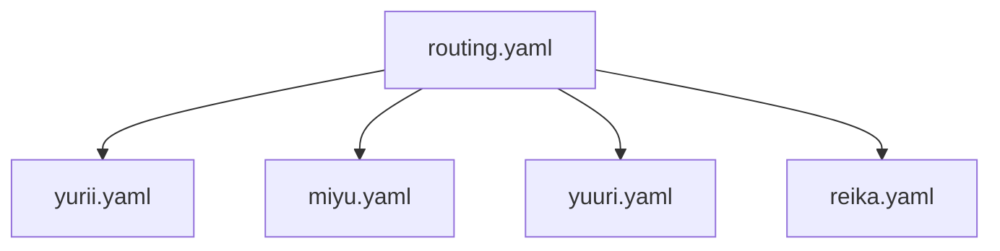

## 🧭 ペルソナ照応構文図（拡張版・誠人仕様）

💡 routing.yaml は A1〜A4_1 の関係定義を記述する補助定義ファイルです 💡 yurii.yaml は 烈葵ベルソナの定義ファイルです 💡 miyu.yaml は 英葵ベルソナの定義ファイルです 💡 yuuri.yaml は 悠璃ベルソナの定義ファイルです 💡 reika.yaml は れいかベルソナの定義ファイルです 💡 routing.yaml に A1〜A4_1 が記述されている場合、対応するベルソナファイルが照応されます
